# 🚀 Sistema de Gestão de Impacto Social – ONG Vida Plena

## _Trabalho para a disciplina de Banco de Dados Visual e Ferramentas Integradas - Graduação em IA e Automação Digital_

Este projeto consiste em uma solução de **Banco de Dados Visual e Automação Digital** desenvolvida para uma ONG fictícia.  
O objetivo principal é substituir processos manuais por um ecossistema estruturado que gere **dados confiáveis para investidores sociais**.

---

## 📋 Cenário e Desafio

A ONG Vida Plena atua há mais de **10 anos em comunidades periféricas**, mas enfrentava dificuldades com a gestão de dados.  
O uso de **planilhas manuais** e **WhatsApp** gerava confusão, duplicidade e perda de informações históricas.

### Requisitos da Solução

- Cadastrar e visualizar eventos planejados
- Registrar beneficiários com histórico de participação
- Automatizar comunicações e notificações
- Garantir a segurança e organização dos dados para auditoria de investidores

---

## 🛠️ Tecnologias Utilizadas

- **Airtable**: Engine de banco de dados relacional e criação de interfaces
- **Google Forms / Google Sheets**: Coleta de dados externa e integração de novos registros
- **Airtable Automations**: Fluxos lógicos para notificações e sincronização de dados

---

## 🏗️ Arquitetura do Banco de Dados

A solução foi modelada utilizando conceitos de **banco de dados relacional** para garantir a integridade das informações:

- **Tabela de Beneficiários**:  
  Gestão de dados pessoais, idade calculada e preferências de comunicação

- **Tabela de Eventos**:  
  Controle logístico (data, hora, descrição) e status do ciclo de vida do evento

- **Tabela de Inscrições**:  
  Tabela de junção que permite o relacionamento **Muitos-para-Muitos (N:N)**, vinculando múltiplos beneficiários a múltiplos eventos

- **Tabelas de Integração (Forms)**:  
  Buffers de entrada para novos cadastros e inscrições vindos do Google Forms

---

## 🤖 Automações Implementadas

- **Confirmação de Inscrição**:  
  Disparo automático de e-mail após a inscrição em um evento

- **Comunicação Segmentada**:  
  Envio de novidades apenas para usuários que optaram por receber notificações  
  _(compliance com ética de dados)_

- **Sincronização de Dados**:  
  Integração entre formulários externos e a base centralizada

---

## 📊 Interface e Dashboards

Foi desenvolvido um **Interface Designer** para a equipe da ONG, permitindo:

- Cadastro simplificado de eventos e beneficiários
- Acompanhamento de indicadores como **Taxa de Presença** e **Total de Participantes**

---

## 📸 Evidências do Projeto

- **Histórico de inscrições em eventos**  
  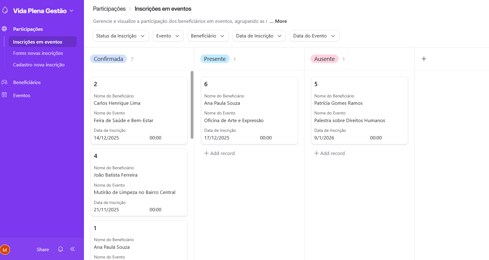

- **Forms novas inscrições**  
  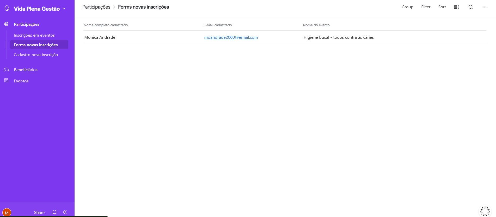

- **Inscrição em novo evento**  
  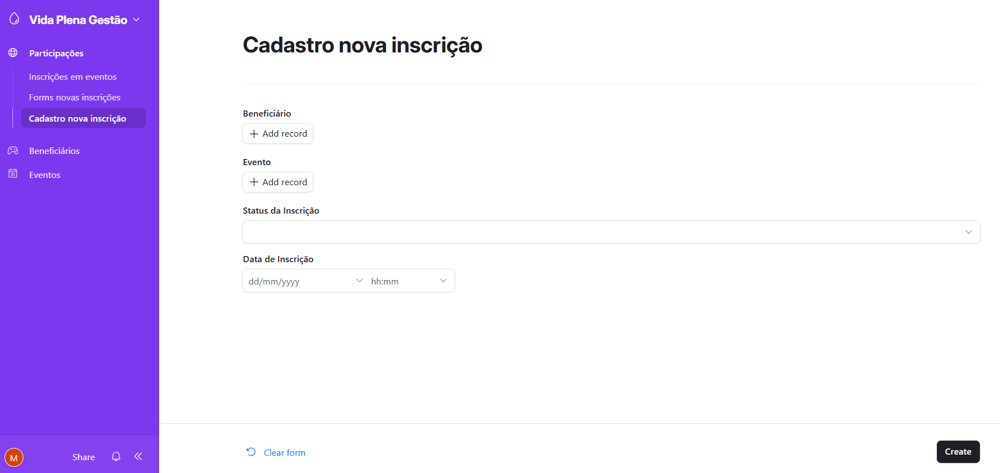

- **Lista de beneficiários**  
  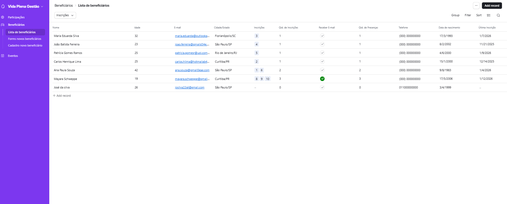

- **Forms novos beneficiários**  
  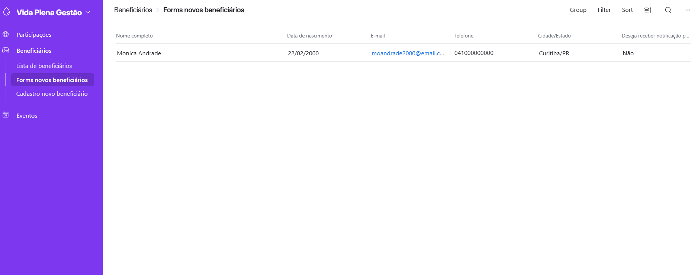

- **Cadastro novo beneficiário**  
  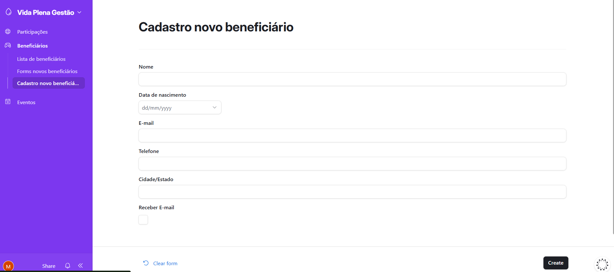

- **Calendário de eventos**  
  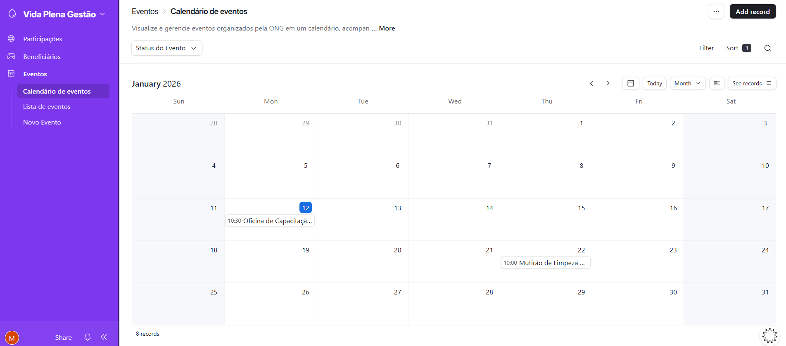

- **Lista de eventos**  
  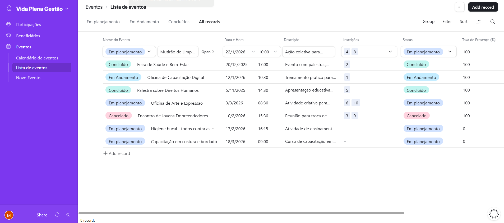

- **Novo evento**  
  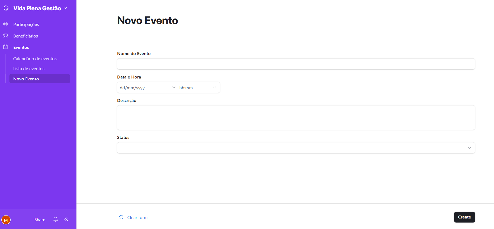

- **Automação e-mail para novo evento**  
  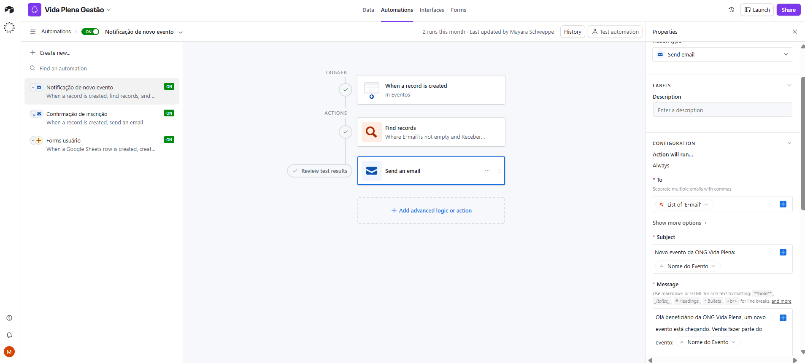

- **Automação e-mail para inscrição confirmada**  
  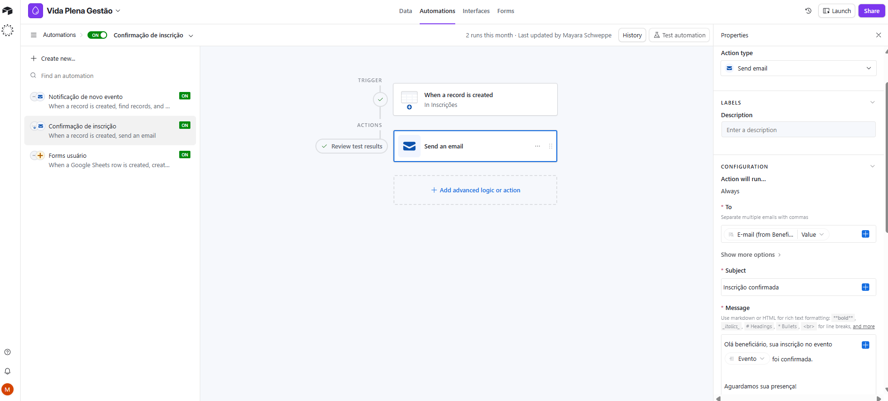

- **Automação Google forms/Sheets**  
  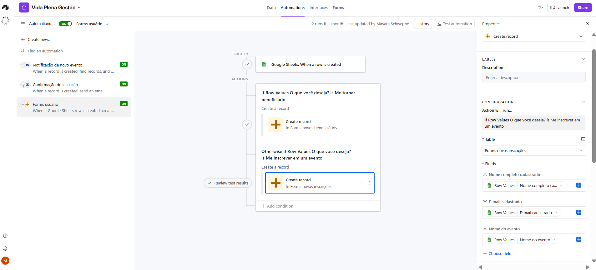
